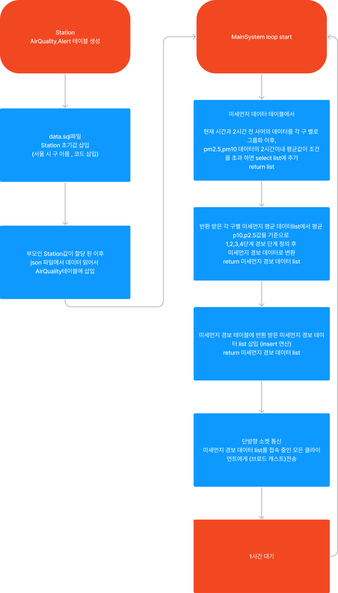
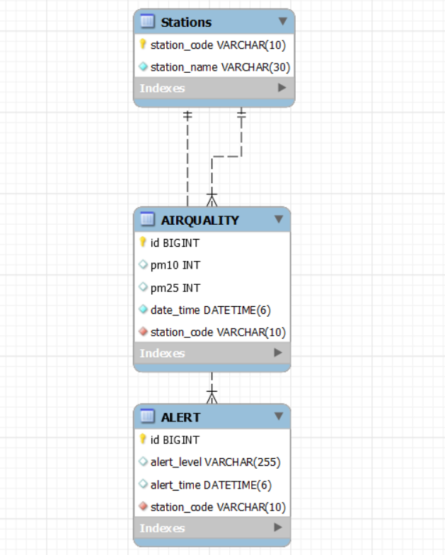

기술 스택
1. MYSQL
2. Spring Boot
3. JAVA
4. thymeleaf
5. HTML
6. JavaScript

Version
1. jdk corretto-21
2. MYSQL 8.0.35
3. Spring WebSocket 인스톨

프로그램 실행 방법
1. MainSystem의 테스트코드 주석하고, 실제 동작코드 주석해제하기
2. Issuing_Alert_Levels 실행
3. 웹 페이지를 열고, http://localhost:8080/ 접속(db에 2024년도 데이터는 없어서 출력값X .)
4. 샘플 테스팅으로 체점 하는것 추천
5. application.yml파일 작성

샘플 테스팅 방법
1. MainSystem의 테스트코드 주석해제, 실제 동작코드 주석처리하기
2. Issuing_Alert_Levels 실행
3. 웹페이지를 열고, http://localhost:8080/ 접속

프로젝트 부가 설명
1. index.html: 사용자가 경보 알림을 받을 수 있는 클라이언트 웹페이지의 소스 코드입니다. 이 페이지를 통해 사용자는 실시간 경보 상황을 확인할 수 있습니다.
2. 데이터베이스 최적화: ALERT 테이블에 station_code과 alert_time 열에 대한 인덱스를 설정하여 SELECT 연산의 성능을 향상 시켰습니다. 
3. 데이터베이스 최적화: ALERTQUALITY 테이블에 date_time 필드에 인덱싱을 설정하여 SELECT 연산의 성능을 향상시켰습니다. 
4. 소켓 통신: 프로젝트에는 서버에서 클라이언트로 데이터를 전송하는 단방향 소켓 통신이 구현되어 있습니다. 이 통신은 모든 접속한 클라이언트에게 경보 정보를 브로드캐스트하는 기능을 포함하고 있습니다. 통신의 신뢰성은 보장되지 않습니다.
5. 데이터베이스 초기(전처리) 설정: 프로젝트에 필요한 데이터베이스 초기 설정은 이미 완료되었습니다. 제공된 application.yml 파일에는 프로젝트 실행에 필요한 개인 정보가 포함되어 있으므로, 이 정보는 유출되지 않도록 주의해야 합니다. 이 파일은 프로젝트가 정상적으로 실행될 수 있도록 설정되어 있습니다.
6.  JSON 파일 처리: 이 프로젝트에 포함된 JSON 파일은 데이터 전처리 과정을 이미 거쳤습니다. 데이터 형식 변환 예시로, 'xxxx-xx-xx 24' 시간 표기는 'xxxx-xx-(xx+1) 00' -> LocalDataTime 패턴으로 변환되어 있습니다. 이는 날짜가 변경되는 자정을 반영합니다.

프로젝트 전처리 과정 (db 초기값 세팅)
1. json파일의 날짜를 Time_value_preprocessing.java 클래스주석을 해제하고, 실행
   날짜를 xxxx-xx-xx 24 -> xxxx-xx-(xx+1) 00 -> yyyy-mm-ddTtt:mm:ss  형식으로 변환할것.
2. DataInitializer.java 클래스 주석을 해제하고, 실행해서 json데이터를 db의 AIRQUALITY테이블에 적재할것.
3. MainSystem 실행  

프로그램 흐름도

 

ERD 다이어 그램

